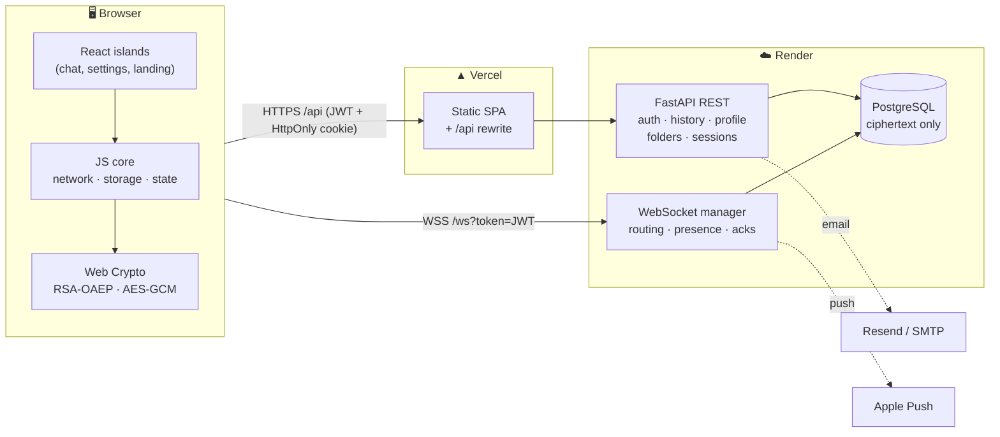
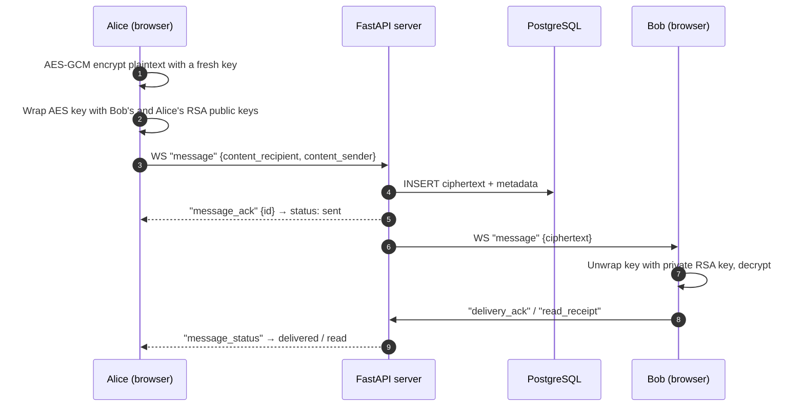

<div align="center">


**A private messenger where only you and the person you're talking to can read your messages.**

[**Open Nexa →**](https://nexa.ashytyk.com)

[](https://nexa.ashytyk.com)
[](LICENSE)
[](https://react.dev/)
[](https://www.typescriptlang.org/)
[](https://fastapi.tiangolo.com/)
[](https://www.postgresql.org/)

[For users](#-for-users) · [For engineers & recruiters](#-for-engineers--recruiters) · [License](#-license)


</div>

---

## 👋 For users

### What is Nexa?

Nexa is a web messenger built around one idea: **your conversations belong to you.**
Every message is locked on your device before it is sent and unlocked only on the device of the person you're writing to. The Nexa server delivers messages but **cannot read them** — not the admin, not the hosting provider, not anyone who gets access to the database.

No phone number is required. Pick a username, verify your email, and start chatting.

### Why use it?

| | |
|---|---|
| 🔒 **Truly private** | Messages are end-to-end encrypted in your browser. The server only ever stores scrambled data. |
| ⚡ **Instant** | Messages, typing indicators, and read receipts arrive in real time. |
| 💻 **Works on any computer** | Nothing to install — open the site on your Mac or PC and sign in. |
| 🎨 **Yours to style** | Light Emerald, Light Lime, and Dark Neon themes, plus compact or comfortable message density. |
| 🧭 **You decide what others see** | Hide your online status, typing indicator, or read receipts. |

### What you can do

- 💬 **Chat one-on-one** with replies, emoji reactions, and link previews with safety warnings
- ✅ **See message status** — sent, delivered, read
- 🗂️ **Organize chats into folders** and keep important messages in *Saved Messages*
- 🔍 **Find people** by username, or share your personal **QR code** so friends can add you in a tap
- 🖥️ **Manage your devices** — see where you're signed in and log out any session remotely
- 🔑 **Recover your account** with an emailed reset link
- 📤 **Export a chat** or delete a message or whole conversation for both sides
- ⌨️ **Work fast** with keyboard shortcuts, drafts that survive a reload, and context menus

### A look inside

<table>
  <tr>
    <td align="center" width="50%">
      <br>
      <sub><b>Profile</b> — name, handle, bio, status, and identity key</sub>
    </td>
    <td align="center" width="50%">
      <br>
      <sub><b>Appearance</b> — themes, message density, live preview</sub>
    </td>
  </tr>
  <tr>
    <td align="center">
      <br>
      <sub><b>Security</b> — encryption status, safety code, devices, password</sub>
    </td>
    <td align="center">
      <br>
      <sub><b>Privacy</b> — presence, read receipts, typing, link warnings</sub>
    </td>
  </tr>
  <tr>
    <td align="center">
      <br>
      <sub><b>Data</b> — local storage, chat export, account deletion</sub>
    </td>
    <td align="center">
      <br>
      <sub><b>Light Emerald</b> — the same chat in a light theme</sub>
    </td>
  </tr>
</table>

### Getting started

1. Go to **[nexa.ashytyk.com](https://nexa.ashytyk.com)** on a desktop browser.
2. Create an account and confirm the 6-digit code sent to your email.
3. Search for a friend's username (or scan their QR code) and say hi.

> [!IMPORTANT]
> Your password also protects your encryption key. **Nexa cannot recover your old messages if you lose access to your key** — that's the price of real privacy.

> [!NOTE]
> Nexa is an independent project in active development and has not had an external security audit. Please don't rely on it for life-critical communication yet.

---

## 🛠 For engineers & recruiters

### TL;DR

Nexa is a **full-stack, end-to-end encrypted real-time messenger** that I designed, built, and deployed solo.

- **Client-side cryptography** with the Web Crypto API — hybrid RSA-OAEP + AES-GCM, password-wrapped private keys for multi-device login.
- **Real-time layer** on WebSockets with delivery/read acknowledgements, presence, typing, and an offline queue.
- **Production-grade auth** — short-lived JWT access tokens, rotating refresh tokens in `HttpOnly` cookies (stored hashed), per-device session management, email OTP verification, and password reset.
- **FastAPI + PostgreSQL** backend with Alembic migrations and a pytest suite running against a throwaway real Postgres.
- **Incremental frontend migration** from vanilla JS to **React 19 + TypeScript** via lazily loaded "islands", without a rewrite freeze.
- Deployed on **Vercel** (frontend) and **Render** (API + Postgres), with **Apple Push Notifications** for the iOS companion app.

### Tech stack

| Layer | Technologies |
|---|---|
| **Frontend** | React 19, TypeScript, Vite 8, Tailwind CSS 4, Motion / Framer Motion, GSAP, Three.js, Base UI, Vaul, Lucide |
| **Legacy client core** | Vanilla JavaScript (ES modules) — networking, storage, crypto, overlays |
| **Cryptography** | Web Crypto API — RSA-OAEP-2048 (SHA-256), AES-GCM-256, PBKDF2-SHA256 |
| **Backend** | Python 3, FastAPI, Uvicorn, native WebSockets |
| **Database** | PostgreSQL, psycopg2 `ThreadedConnectionPool`, Alembic migrations |
| **Auth & security** | PyJWT (HS256), bcrypt, SHA-256-hashed refresh tokens & OTPs, `HttpOnly` / `SameSite` cookies, CORS allowlist |
| **Integrations** | Resend / SMTP (transactional email), APNs over HTTP/2 via `httpx` (push), `qrcode` + Pillow |
| **Testing** | pytest, `pgserver` (disposable PostgreSQL), FastAPI `TestClient` |
| **Infrastructure** | Vercel (static hosting + `/api` rewrite proxy), Render (API + managed PostgreSQL) |

### Architecture



The frontend and API are served from **the same origin** (`/api` is proxied by Vercel in production and by Vite in development), so the refresh cookie can stay `SameSite=Lax` instead of relying on third-party cookies.

### How end-to-end encryption works

1. **On sign-up** the browser generates an RSA-OAEP key pair. The public key is uploaded as a JWK; the private key is encrypted with a key derived from the user's password (**PBKDF2-SHA256, 100 000 iterations → AES-GCM-256**) and uploaded as an opaque blob. This is what lets the same account sign in on a new device without the server ever seeing the key.
2. **On send**, every message gets a fresh AES-256 key and IV. The plaintext is encrypted with AES-GCM, and the AES key is wrapped with RSA-OAEP **twice** — once for the recipient and once for the sender — so both sides can read their history later.
3. **The server** stores and relays only the two envelopes (`content_recipient`, `content_sender`) plus routing metadata.



<details>
<summary><b>What the server can and cannot see</b></summary>

| ✅ Server sees | ❌ Server never sees |
|---|---|
| Usernames, email, bcrypt password hash | Message plaintext |
| Public keys (JWK) | Private keys in decrypted form |
| Password-encrypted private key blob | Plaintext passwords |
| Ciphertext + timestamps, reply links, delivery/read times | AES message keys |
| Profile fields (name, bio, avatar), reactions | |

</details>

<details>
<summary><b>Known limitations (honest threat model)</b></summary>

- **No forward secrecy** — messages use long-lived RSA keys; a leaked private key exposes stored history. A Double Ratchet / X3DH design is the natural next step.
- **Trust in the served bundle** — as with any web E2EE app, users trust that the deployed JavaScript is the published one.
- **Metadata is visible** — who talks to whom and when is known to the server.
- **Profiles are not encrypted** — display name, bio, and avatar are stored in plaintext.
- **No independent audit** yet.

</details>

### Engineering highlights

<details open>
<summary><b>Authentication & sessions</b></summary>

- Short-lived **JWT access tokens** carry a session id (`sid`); **refresh tokens** are 48-byte random secrets delivered only in an `HttpOnly` cookie scoped to `/api`.
- The database stores **only the SHA-256 of refresh tokens**, so a leaked table can't be replayed. Sessions slide for 7 days from last use.
- Users can list their sessions/devices and **revoke one or all others**; revoked sessions receive a `session_terminated` event over the WebSocket and are logged out instantly.
- **Email OTP** verification: 6-digit codes stored as peppered hashes, 15-minute TTL, 5-attempt limit, 60-second resend throttle. Password-reset links follow the same pattern.

</details>

<details>
<summary><b>Real-time messaging</b></summary>

- One authenticated WebSocket per client; the handshake validates the JWT and rejects a `join` whose username differs from the token subject.
- Event protocol covers `message`, `message_ack`, `message_sync`, `message_status`, `reaction_sync`, `typing`, `presence` / `presence_sync`, `unread_sync`, `message_deleted`, `conversation_deleted`, `profile_updated`, `new_chat`, and more.
- Client-generated `client_message_id`s let the **optimistic UI** show a message instantly and reconcile it with the server id on `message_ack`.
- Messages to offline users are queued and flushed on reconnect; the client reconnects with backoff.
- The UI patches the DOM incrementally instead of re-rendering the whole message list.

</details>

<details>
<summary><b>Frontend architecture</b></summary>

- Started as a framework-free SPA; now **migrating to React + TypeScript island by island**. Each island (`mountChat`, `mountStartSite`, auth flows, settings drawers) is code-split and loaded with dynamic `import()`.
- A typed **`chatEngine`** + event emitter separates chat state and crypto from the view layer, exposed to React via a `useChatEngine` hook.
- Vite `dedupe` / `optimizeDeps` configuration guarantees a single React instance across lazily loaded chunks.
- Design system built on CSS custom properties and Tailwind 4, with multiple themes and adjustable glassmorphism.

</details>

<details>
<summary><b>Backend & data</b></summary>

- FastAPI split into domain routers: `auth`, `sessions`, `devices`, `users`, `profile`, `history`, `folders`, `saved`, `qr`, `websocket`.
- **13 Alembic migrations** track the schema from baseline through sessions, email verification, folders, and password reset.
- Tests boot a **disposable PostgreSQL** with `pgserver`, apply the real migrations, and run the app against it — no mocks for the database, and no access to production secrets.

</details>

### Project structure

```text
.
├── backend/
│   ├── main.py               # FastAPI app, CORS, router registration
│   ├── routers/              # auth, sessions, devices, users, profile, history, folders, saved, qr, websocket
│   ├── core/                 # config, security (JWT/bcrypt), auth sessions, email verification
│   ├── ws_manager.py         # WebSocket connections, routing, presence, acks
│   ├── database.py           # SQL access + connection pool
│   ├── apns.py               # Apple Push Notification client (HTTP/2)
│   ├── alembic/versions/     # Schema migrations
│   └── tests/                # pytest suite on a throwaway PostgreSQL
└── frontend/
    ├── index.html            # SPA shell
    ├── js/                   # Core client: app, api, network, crypto, storage, message logic
    ├── src/
    │   ├── chat/             # React chat island: engine, hooks, regions (sidebar, feed, input…)
    │   ├── auth/             # Verify email, forgot / reset password
    │   ├── settings/         # Devices, password, danger-zone drawers
    │   ├── components/       # UI kit + landing page sections
    │   └── start/            # Landing page island
    ├── ui/overlays/          # Menus, popovers, modals, reaction picker
    ├── vite.config.js
    └── vercel.json           # SPA fallback + /api proxy
```

> [!TIP]
> Reviewing the security model? Start with [`frontend/js/crypto.js`](frontend/js/crypto.js), [`backend/core/auth_sessions.py`](backend/core/auth_sessions.py), and [`backend/routers/websocket.py`](backend/routers/websocket.py).

---

## 📄 License

Distributed under the **GNU Affero General Public License v3.0**. See [`LICENSE`](LICENSE) for details.

<div align="center">

Built by **[Jan Shytyk](https://github.com/shytyk-develop)** · [nexa.ashytyk.com](https://nexa.ashytyk.com)

</div>
